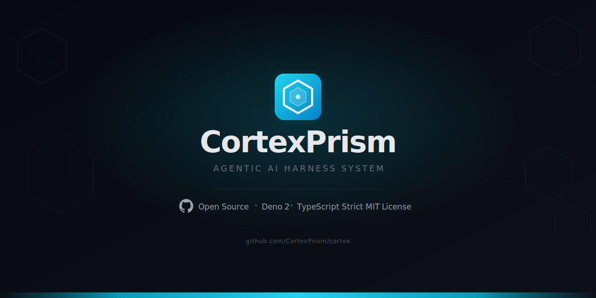

# CortexPrism

<p align="center">
  
</p>

## Star History

<a href="https://www.star-history.com/?repos=CortexPrism%2Fcortex&type=date&legend=top-left">
 <picture>
   <source media="(prefers-color-scheme: dark)" srcset="https://api.star-history.com/chart?repos=CortexPrism/cortex&type=date&theme=dark&legend=top-left" />
   <source media="(prefers-color-scheme: light)" srcset="https://api.star-history.com/chart?repos=CortexPrism/cortex&type=date&legend=top-left" />
   
 </picture>
</a>

> **The open-source AI agent operating system — autonomous agents with memory, tools, a web UI, and
> layered security, powered by Deno.**

[](LICENSE)
[](https://deno.land)
[](CHANGELOG.md)
[](https://github.com/CortexPrism/cortex/actions/workflows/ci.yml)
[](https://discord.gg/wYxbmQeWY3)

**CortexPrism** is a self-hosted, open-source **AI agent operating system** — an autonomous agent
runtime that turns any LLM into a capable digital agent. It provides persistent memory, a rich tool
ecosystem, sandboxed code execution, multi-agent orchestration, a full-featured web UI, and
enterprise-grade security — all running locally on your machine or server.

- Works with **30 LLM providers** out of the box (Anthropic, OpenAI, Gemini, Groq, Ollama, and more)
- Ships as a **single Deno binary** — no Docker required to get started
- **100% open source** — Apache 2.0 licensed, no telemetry, data stays on your machine

---

## Table of Contents

- [Features](#features)
- [Requirements](#requirements)
- [Quick Start](#quick-start)
- [CLI Reference](#cli-reference)
- [Configuration](#configuration)
- [Web UI](#web-ui)
- [Security Model](#security-model)
- [Plugin System](#plugin-system)
- [Architecture](#architecture)
- [Contributing](#contributing)
- [License](#license)

---

## Features

### AI Providers & Model Routing

- **30 LLM providers** — Anthropic Claude, OpenAI GPT, Google Gemini, Mistral, Groq, DeepSeek,
  OpenRouter, xAI Grok, Together AI, AWS Bedrock, Cohere, Ollama (local models), Cerebras,
  Fireworks, Perplexity, NVIDIA NIM, Moonshot (Kimi), Novita AI, LM Studio, LiteLLM, Hugging Face,
  Alibaba (Qwen), Venice AI, Kilo AI, DeepInfra, Hyperbolic, MiniMax, Zhipu (GLM), Replicate,
  Cloudflare Workers AI
- **Multimodal input** — upload images and documents; native vision support for Anthropic and Google
  Gemini; PDF text auto-extracted for all providers
- **Model Quartermaster (MQM)** — intelligent model selection that learns which model performs best
  for each task type using a 6-signal prediction engine with adaptive EMA learning and three arbiter
  strategies (conservative / balanced / aggressive)
- **Model router** — RouteLLM-style cascade (cheapest-first escalation) and threshold
  (prompt-scoring) routing strategies

### Agent Capabilities

- **Interactive streaming chat** — CLI and Web UI with real-time streaming, session persistence, and
  session resume
- **Tool use with approval gates** — every tool call is reviewed by the security policy before
  execution; agents can request human approval for sensitive operations
- **Sub-agent orchestration** — agents can spawn 11 specialized child agents (Explorer, General,
  Planner, Coder, Researcher, Security, Debugger, Architect, DevOps, Data Analyst, UI/UX Designer)
  for parallel and delegated work
- **Per-turn reflection** — LLM self-assessment of confidence and quality after each response; meta-
  pattern consolidation over time
- **Voice pipeline** — speech-to-text (OpenAI Whisper), text-to-speech (OpenAI TTS / ElevenLabs),
  energy-based VAD, real-time audio streaming over WebSocket
- **Computer use** — GUI automation via virtual displays (Xvfb) with mouse, keyboard, and screenshot
  actions; Docker-isolated or native runtime
- **Code intelligence** — tree-sitter WASM code indexing across 14+ languages; call graph traversal,
  impact analysis, architecture extraction, and symbol search
- **Browser automation** — headless Playwright-powered browser for web navigation, interaction,
  screenshots, and accessibility snapshots

### Memory System

- **5-tier memory** — episodic (FTS5 full-text search), semantic (vector embeddings), procedural
  (skills), graph (knowledge graph), and reflection (learned patterns) with multi-strategy retrieval
  and decay scoring
- **Heuristic self-learning** — AI-driven memory improvement: access-tracking importance boosting,
  decay-slowing for frequent memories, co-occurrence graph relations, and 12-rule
  auto-categorization
- **Hybrid search** — keyword (FTS5 BM25) + vector (cosine similarity) search with time-decay
  scoring
- **Automatic memory injection** — relevant memories are injected into each turn's system prompt
- **Memory search CLI** — keyword, semantic, and hybrid search from the terminal
- **Memory health dashboard** — aggregated metrics for active/stale counts, decay, importance,
  access frequency, and graph stats

### Skills System

- **Self-learning skills** — the agent automatically extracts reusable procedural patterns from
  successful tool-call sequences and stores them as versioned, quality-scored skills
- **Skill lifecycle** — 6-state lifecycle (candidate → verified → released → degraded → deprecated →
  archived) with automatic health monitoring and staleness detection
- **Embedding-based retrieval** — skills are matched to user queries via cosine similarity over
  precomputed embeddings, with lexical fallback for cold starts
- **Skill deduplication** — similar skills are automatically detected and merged, preserving steps
  and bumping versions; LLM-extracted skills are deduplicated on creation
- **Dependency tracking** — skills can declare `depends_on` and `conflicts_with` relationships;
  deletion is blocked if other skills depend on the target
- **Trust tiering** — 4-tier system (1=LLM-extracted, 4=built-in vetted) gates agent skill exposure
- **Health system** — composite quality scores from utility, freshness, redundancy, and failure
  risk; automatic maintenance deprecates stale/low-quality skills
- **Tool-accessible** — `load_skill`, `skill_read`, `skill_write`
  (create/update/delete/merge/promote/deprecate)
- **Web UI & REST API** — full skill library management with lifecycle badges, trust stars,
  dependency graphs, health reports, and bulk operations
- **Skill SDK** — define skills as TypeScript modules (`src/skills/builtin/`) or markdown files in
  `.cortex/skills/<name>/SKILL.md` with YAML frontmatter

See [docs/SKILLS.md](docs/SKILLS.md) for the full reference.

### Code Intelligence (Codegraph)

- **Multi-language parsing** — tree-sitter WASM parser for 14+ languages (TS, JS, Python, Go, Rust,
  Java, Kotlin, C, C++, Ruby, PHP, Swift, Lua, Bash)
- **Call graph resolution** — 6-strategy call target resolution with import analysis across all
  supported languages
- **Code graph storage** — 14 node labels (CodeProject, CodeFile, CodeFunction, CodeClass, etc.), 18
  edge types (CALLS, IMPORTS, DEFINES, IMPLEMENTS, INHERITS, HTTP_CALLS, DECORATES, etc.)
- **6 agent tools** — code_index, code_search_symbol, code_trace_path, code_get_architecture,
  code_analyze_impact, code_list_projects
- **Web UI** — D3.js force-directed dependency graph with symbol search, impact analysis, and path
  tracing
- **Incremental sync** — file-hash-based change detection with chunked bulk insert and BFS-batched
  queries

### Built-in Tools

| Category          | Tools                                                                                           |
| ----------------- | ----------------------------------------------------------------------------------------------- |
| File system       | read, write, edit, patch, delete, rename, copy, move, list, tree, info, search, glob, undo/redo |
| Shell             | execute shell commands (sandboxed through policy validator)                                     |
| Web               | web_search, web_fetch, web_crawl, docs_search (Context7 docs), firecrawl (web scraping)         |
| Code execution    | sandboxed Docker/gVisor containers with resource limits; LLM auto-fix loop                      |
| Browser           | navigate, click, type, screenshot, snapshot, evaluate, wait (Playwright headless automation)    |
| GitHub            | PR creation/listing, issue tracking, repo browsing, git push                                    |
| Git workspace     | status, commit, push, pull, branch, clone                                                       |
| Voice             | speak, listen (STT/TTS agent tools)                                                             |
| Data & Util       | memory_note, memory_search, db_query, structured_extract, json_query, regex_utils, code_snippet |
| Environment       | env_manager (get/set variables), schedule (cron-based job scheduling)                           |
| Sandbox           | environment snapshots, workspace snapshots, dev env as code, bug reproduction studio            |
| Image & Vision    | image_analyze (multimodal image analysis via 18+ LLM providers)                                 |
| Sub-agents        | spawn typed child agents for parallel and delegated tasks                                       |
| Skills            | load_skill, skill_read, skill_write (create/update/delete/merge/promote/deprecate)              |
| Dashboard         | dashboard_manage — CRUD operations on dashboard widgets                                         |
| Nodes             | node_dispatch — dispatch tasks to remote distributed nodes                                      |
| Code Intelligence | code_index, code_search_symbol, code_trace_path, code_analyze_impact, code_get_architecture     |
| Computer Use      | screenshot, left_click, type, key, scroll, mouse_move, drag (GUI automation via Xvfb + xdotool) |

### Web UI & REST API

- **Built-in HTTP server** — `cortex server start` starts a WebSocket-powered chat UI on port 3000
- **Pages**: Chat, Dashboard, Editor, VCS, Sessions, Memory, Skills, Soul, Agents, Services, Nodes,
  Daemons, Automation, Channels, Tools, MCP, Codegraph, Policies, Vault, Settings, Quartermaster,
  Extensions, Analytics, Lens (Activity), Workflows, Eval Runner, Computer Use, Remote Agents,
  Sandbox, Prompt Lab, PKM, Metacognition, Voice, Tunnel, Projects, Teams, Users
- **File upload** — drag-and-drop or click to attach PDFs, images, and documents in chat
- **REST API** — full HTTP API for sessions, memory, jobs, git, GitHub, and code execution
- **Session persistence** — page refresh resumes the active session (full history preserved)

### Security (Parallax Model + LLM Supervisor)

- **Policy validator** — every tool call is evaluated against regex allow/deny rules before
  execution
- **Dynamic tool permission grant** — per-task permission evaluation with risk profiles and
  guardrails (readOnly, restrictedPaths, allowedDomains, requireConfirmation)
- **Tool approval workflow** — structured approval pipeline with auto-approve thresholds, webhook
  notifications, and 5-minute timeouts
- **LLM supervisor** — sensitive data access (memory, databases, screenshots) requires approval from
  a fast LLM supervisor model (Gemini 2.0 Flash, GPT-4o Mini) with decision caching and human
  escalation for uncertain cases
- **Data classification** — automatic sensitivity detection (SECRET/SENSITIVE/NORMAL/PUBLIC) based
  on pattern matching (passwords, API keys, PII, confidential markers); all existing data backfilled
  on first run
- **DLP Guard** — 22-scanner data loss prevention scanning all agent outputs for sensitive data (API
  keys, credentials, PII, PHI, PCI); supports monitor/redact/block action levels
- **AI Guardrails** — pluggable content safety middleware with 5 built-in classifiers: prompt
  injection (10 patterns), PII leakage, harmful code, excessive length, and shell injection
- **Session isolation** — multi-tenant data isolation with path-based and environment-variable
  gating across strict, permissive, and shared modes
- **Human approval flows** — CLI color-coded prompts and Web UI modal for sensitive access requests,
  with AI supervisor reasoning and sample data preview
- **Temporary grants** — approved access cached per session to prevent approval fatigue while
  maintaining security
- **AES-256-GCM vault** — encrypted credential storage with PBKDF2 key derivation
- **Default deny rules** — ships with protection against `rm -rf /`, fork bombs, direct disk writes
- **Activity** — full audit log of all sessions, tool calls, LLM calls, policy decisions, and
  security approvals with cost tracking See
  [docs/SECURITY_SUPERVISOR.md](docs/SECURITY_SUPERVISOR.md) for the full architecture.

### Computer Use (GUI Automation)

- **Virtual display** — X11 virtual framebuffer (Xvfb) lifecycle management with multi-display
  support
- **Mouse control** — coordinate-based movement, left/right/middle clicks, double/triple clicks,
  drag
- **Keyboard control** — text typing with configurable delays, key combinations, key holding
- **Screenshot capture** — PNG/JPEG output via scrot, ImageMagick, or xwd with automatic fallback
- **15 agent actions** — screenshot, click, type, key, scroll, wait, mouse_move, drag, and more
- **Security** — all actions gated through policy validator with user approval; sensitive data
  auto-blocked
- **Docker support** — pre-built Ubuntu 22.04 image with XFCE, Firefox, Chromium, LibreOffice
- **Requirements** — `xvfb`, `xdotool`, `scrot` (Linux-only)

See [docs/computer-use/README.md](docs/computer-use/README.md) for the full guide.

### Ops & Extensibility

- **Multi-user collaboration** — users, teams, API tokens with SHA-256 hashing, resource scoping,
  federation between instances
- **Distributed swarm** — cross-instance agent coordination via A2A protocol with fleet topology,
  resource aggregation, and directive dispatch
- **Scheduled jobs** — SQLite-persisted cron with automatic retry
- **Daemon supervisor** — manages validator, executor, and scheduler processes with exponential
  backoff restart
- **Plugin system** — WASM and Deno module plugins with sandboxed permissions
- **MCP Gateway** — enterprise MCP server management with rate limiting, health checks, audit
  logging
- **A2A Protocol Bridge** — Google Agent2Agent (A2A) v1.0 protocol for cross-framework agent
  collaboration with JSON-RPC 2.0 server/client, SSE streaming, and tool wrapping
- **Memori Checkpointing** — persistent agent state serialization and restore for survival across
  restarts, crashes, and context window resets
- **Supply chain integrity** — plugin verification with SHA-256 hash checking, signature
  verification, author reputation scoring, and malware pattern scanning
- **Dependency guardian** — continuous CVE monitoring, license enforcement, and remediation
  suggestions across 6 package ecosystems
- **AgentLint** — automated auditing of agent configs, tools, plugins, and prompts with 33+ checks
- **Auto-update** — `cortex self update` supports source mode and signed binary mode with SHA-256
  and optional GPG verification
- **Desktop app** — Tauri-based desktop wrapper (macOS, Windows, Linux)

---

## Requirements

| Requirement                   | Notes                                                                            |
| ----------------------------- | -------------------------------------------------------------------------------- |
| [Deno 2.x](https://deno.land) | Required — the installer handles this automatically                              |
| Docker                        | Optional — needed for sandboxed code execution; subprocess fallback is available |
| macOS, Linux, or Windows      | All platforms supported                                                          |

---

## Quick Start

### Option 1: One-line installer (recommended)

**macOS / Linux:**

```bash
curl -fsSL https://cortexprism.io/install.sh | bash
```

**Windows (PowerShell):**

```powershell
irm https://cortexprism.io/install.ps1 | iex
```

The installer: checks for / installs Deno, clones Cortex to `~/.cortex`, creates the `cortex` CLI
alias, and runs database migrations. After install, run `cortex setup` to configure your first LLM
provider.

### Option 2: Manual clone

```bash
git clone https://github.com/CortexPrism/cortex.git ~/.cortex
cd ~/.cortex
deno task migrate
deno run --allow-all src/main.ts setup
```

Add `cortex` to your PATH by appending to your shell profile:

```bash
echo 'alias cortex="deno run --allow-all ~/.cortex/src/main.ts"' >> ~/.bashrc
source ~/.bashrc
```

### Option 3: Pre-compiled binary

Download the latest binary from the [Releases page](https://github.com/CortexPrism/cortex/releases).
All binaries include SHA-256 checksums and optional GPG signatures.

### First run

```bash
cortex setup        # Interactive setup wizard — choose provider, enter API key
cortex agent chat         # Start your first chat session
cortex server start        # Open the Web UI at http://127.0.0.1:3000
```

---

## CLI Reference

```
cortex <command>

Commands:
  agent             Agent commands (chat, exec, tui, sessions, eval, reflect, lint, voice)
  setup             Re-run the setup wizard
  server start      Start the HTTP + WebSocket server with Web UI
  daemon            Manage background processes (validator, executor, scheduler)
  sandbox           Code execution in sandboxed environment
  memory            Search and manage memory
  jobs              Manage scheduled jobs
  vault             Encrypted credential vault (store / get / list / delete)
  policy            Security policy rules (list / add / remove / check)
  db migrate        Initialise or migrate all databases
  self update       Check for and apply updates
  config            View and edit configuration
  git               Git workspace operations
  github            GitHub integration (PRs, issues, repos)
  mqm               Model Quartermaster stats and configuration
  qm                Quartermaster tool orchestration stats
  models            List and configure LLM models
  soul              Manage agent identity and personality templates
  plugins           Install and manage plugins
  marketplace       Browse and install from the plugin/agent marketplace
  log               View and manage logging configuration
  service           Manage micro-services (start, stop, install, uninstall)
  node              Manage distributed nodes
  hooks             Manage pipeline hooks
  triggers          Manage event triggers
  channels          Manage channel adapters (Discord, etc.)
  mcp               MCP server commands (serve, stdio, chrome, a2a)
  desktop           Desktop automation
  workflow          Workflow engine operations
  projects          Project management
  swarm             Distributed agent swarm (init, nodes, topology, report)
  login             Authenticate with username/password or API token
  logout            End current authenticated session
  whoami            Show current authenticated user
  users             User management (list, create, disable, enable)
  teams             Team management (list, create)
  compliance        Compliance policy management
  debug             Debug utilities
  memori            Memori checkpointing and persistence
  import            Tool output import
  tunnel            Tunnel management
  run               Execute a task via CLI
  update            Update CortexPrism
  migrate           Run pending database migrations
```

### `cortex agent`

```bash
cortex agent chat                          # Start a new chat session
cortex agent chat --model gpt-4o           # Override the active model
cortex agent chat --resume sess_abc123     # Resume an existing session
cortex agent chat -s sess_abc123           # Resume (short flag)
cortex agent chat --no-stream              # Disable streaming output
cortex agent exec <task>                   # Execute a one-shot agent task
cortex agent tui                           # Launch terminal UI
cortex agent sessions                      # List recent chat sessions
cortex agent eval <suite>                  # Run an evaluation suite
cortex agent reflect                       # Inspect and consolidate reflection patterns
cortex agent lint                          # Run AgentLint auditing
cortex agent voice                         # Voice mode management
```

Slash commands inside chat:

```
/exit   Quit
/help   Show available commands
/clear  Clear the screen
```

### `cortex sandbox run <file>`

Execute a code file in an isolated sandbox with optional LLM auto-fix:

```bash
cortex sandbox run script.py                    # Run in Docker sandbox (auto-detect language)
cortex sandbox run script.py --no-sandbox       # Run as direct subprocess
cortex sandbox run script.py --fix              # Enable LLM auto-fix loop on failure
cortex sandbox run script.py --fix --max-fix 6  # Up to 6 fix attempts
```

Supported languages: `python`, `javascript`, `typescript`, `bash`, `ruby`, `go`, `rust`

### `cortex server start`

Start the built-in HTTP + WebSocket server:

```bash
cortex server start                         # http://127.0.0.1:3000 (foreground)
cortex server start --port 8080 --host 0.0.0.0
cortex server start -d                      # Run in the background (daemon mode)
cortex server start -d -r                   # Restart background server
cortex server start -s                      # Stop background server
cortex daemon stop                          # Stop server + all daemons
cortex daemon stop --server-only
cortex daemon stop --daemon-only
```

### `cortex daemon`

```bash
cortex daemon start                  # Start supervisor in background (auto-restart on crash)
cortex daemon stop
cortex daemon restart
cortex daemon run                    # Run supervisor in foreground (for systemd / tmux)
cortex daemon status
```

Four daemon processes: **Validator** (policy enforcement), **Executor** (tool execution),
**Scheduler** (cron jobs and memory consolidation), **Supervisor** (LLM security supervisor). The
daemon supervisor auto-restarts any crashed daemon with exponential backoff.

### `cortex git`

Full git workspace management for agent and global workspaces:

```bash
cortex git status [--agent <id>]
cortex git log [--agent <id>] [--limit 20]
cortex git diff [--agent <id>] [--stat] [--file <path>]
cortex git add <file...> [--agent <id>]
cortex git add --all [--agent <id>]
cortex git commit <message> [--agent <id>]
cortex git push [--agent <id>] [--remote origin] [--branch <name>]
cortex git pull [--agent <id>]
cortex git clone <url> <dest> [--branch <name>]
cortex git branch [--agent <id>]
cortex git branch --create <name> [--agent <id>]
cortex git branch --checkout <name> [--agent <id>]
cortex git remote --add <name> --url <url> [--agent <id>]
```

### `cortex github`

GitHub integration — requires `GITHUB_TOKEN` env var, `githubToken` in config, or vault entry
`github_token`:

```bash
cortex github pr list <repo> [--state open] [--limit 10]
cortex github pr get <repo> <number>
cortex github pr create <repo> <title> <head> <base> [--body "..."] [--draft]
cortex github pr merge <repo> <number> [--method merge|squash|rebase]
cortex github pr close <repo> <number>
cortex github issue list <repo> [--state open] [--limit 10] [--labels a,b]
cortex github issue create <repo> <title> [--body "..."] [--labels a,b]
cortex github issue close <repo> <number>
cortex github repo list [--type all|owner|public|private] [--limit 20]
cortex github repo get <repo>
cortex github repo branches <repo> [--limit 30]
cortex github token
```

### `cortex agent sessions`

```bash
cortex agent sessions                      # List recent sessions
cortex agent sessions --limit 20           # Limit results
cortex agent sessions --agent <id>         # Filter by agent
```

### `cortex memory`

```bash
cortex memory search "sqlite"           # Keyword + vector hybrid search
cortex memory search "sqlite" --type semantic # Vector only
cortex memory add "CortexPrism uses SQLite WAL mode"
cortex memory health                     # Memory health stats
cortex memory heuristics                 # Trigger heuristic learning
```

### `cortex vault`

AES-256-GCM encrypted credential storage:

```bash
export CORTEX_VAULT_KEY="your-passphrase"

cortex vault store "openai-key" --service openai  # Prompts for the value
cortex vault get "openai-key"
cortex vault list
cortex vault delete "openai-key"
```

The passphrase is never stored — only held in the environment variable at runtime (PBKDF2 key
derivation, 100k iterations, SHA-256).

### `cortex policy`

```bash
cortex policy list
cortex policy add "curl.*evil\.com" --kind shell --effect deny --reason "Blocked domain"
cortex policy check shell "rm -rf /etc"
cortex policy remove pol_abc123
```

Default deny rules (seeded on first migrate):

- `rm\s+-rf\s+/` — recursive root delete
- `:\(\)\{.*\}` — fork bomb patterns
- `dd\s+if=.*of=/dev/` — direct disk writes
- `chmod\s+777\s+/` — world-write on root

### `cortex self update`

```bash
cortex self update              # Check for updates and apply
cortex self update --check      # Dry-run — show available versions without applying
cortex self update --channel pre-release # Include pre-release versions
cortex self update --rollback   # Revert to previous version
cortex self update --status     # Show current and latest version
cortex self update --force      # Bypass dirty working tree check (source mode)
```

Supports **source mode** (git pull) and **binary mode** (download + SHA-256 + optional GPG
verification).

### `cortex mqm`

```bash
cortex mqm stats            # Performance statistics per model
cortex mqm decisions        # Recent routing decisions
cortex mqm weights          # Current signal weights
cortex mqm accuracy         # Prediction accuracy metrics
```

### `cortex agent voice`

```bash
cortex agent voice enable            # Enable voice mode
cortex agent voice disable
cortex agent voice status
cortex agent voice set-voice <voice-id>
```

### `cortex log`

```bash
cortex log show                          # Print last 100 log entries
cortex log show --lines=200 --level=warn # Filter by level
cortex log tail                          # Live tail (Ctrl+C to stop)
cortex log tail --level=debug            # Tail with filters
cortex log clear                         # Truncate the log file
cortex log path                          # Print log file path
cortex log set-level info                # Update log level in config
cortex log status                        # Show current logging config
```

### `cortex plugins`

```bash
cortex plugins install <source>               # Install from URL, local file, or marketplace
cortex plugins list                           # List installed plugins
cortex plugins enable <name>                  # Enable a plugin
cortex plugins disable <name>                 # Disable a plugin
cortex plugins remove <name>                  # Remove a plugin
cortex plugins update <name>                  # Update a plugin
cortex plugins update --all                   # Update all plugins
cortex plugins verify <name>                  # Verify integrity hash
cortex plugins permissions <name>             # Inspect plugin permissions
```

### `cortex agent eval`

```bash
cortex agent eval list                        # List available evaluation suites
cortex agent eval run <suite>                 # Run an evaluation suite
cortex agent eval run <suite> --save-baseline # Save results as baseline
cortex agent eval run <suite> --baseline <name> # Compare against a baseline
cortex agent eval baselines                   # List saved baselines
```

### `cortex eval memory`

```bash
cortex eval memory list                       # List memory evaluation suites
cortex eval memory run <suite>                # Run a memory evaluation
```

### `cortex node`

```bash
cortex node register <name> [--tier root|sudo|unprivileged]   # Register a distributed node
cortex node list                                               # List all nodes
cortex node show <id>                                          # Show node details + metrics
cortex node deregister <id>                                    # Remove a node
cortex node rekey <id>                                         # Rotate node auth token
cortex node connect <endpoint> [--tier <tier>]                 # Connect as a Cortex Node
```

### `cortex mcp`

```bash
cortex mcp serve                              # Start MCP server in HTTP mode
cortex mcp stdio                              # Start MCP server over stdio (Claude Desktop)
cortex mcp chrome                             # Start Chrome Bridge MCP
cortex mcp a2a                                # Manage A2A protocol agents
cortex mcp a2a remote                         # List configured remote A2A agents
```

### `cortex workflow`

```bash
cortex workflow list                          # List defined workflows
cortex workflow run <name>                    # Execute a workflow
cortex workflow approve <runId>               # Approve a pending workflow step
```

### `cortex triggers`

```bash
cortex triggers list                          # List event triggers
cortex triggers add <type> [--pattern <glob>] # Add a file-watch or cron trigger
cortex triggers remove <id>                   # Remove a trigger
cortex triggers install-hooks                 # Install git post-receive/commit hooks
cortex triggers uninstall-hooks               # Remove git hooks
```

### `cortex hooks`

```bash
cortex hooks list                             # List pipeline hooks
cortex hooks disable <name>                   # Disable a hook
cortex hooks init                             # Initialize hook config
```

### `cortex channels`

```bash
cortex channels list                          # List configured channels
cortex channels start <name>                  # Start a channel adapter
cortex channels stop <name>                   # Stop a channel adapter
```

### `cortex desktop`

```bash
cortex desktop screenshot                     # Capture a screenshot
cortex desktop click <x> <y>                  # Click at coordinates
cortex desktop type <text>                    # Type text
cortex desktop keypress <key>                 # Press a key or key combination
cortex desktop clipboard get|set <text>       # Clipboard operations
cortex desktop dockerfile                     # Generate Docker desktop container config
cortex desktop entrypoint                     # Generate desktop automation entrypoint
```

### `cortex projects`

```bash
cortex projects list                          # List workspace projects
cortex projects create <name>                 # Create a new project
cortex projects delete <name>                 # Delete a project
```

---

## Configuration

Config file: `~/.cortex/config.json` (created by `cortex setup`)

```json
{
  "version": 1,
  "defaultProvider": "anthropic",
  "providers": {
    "anthropic": { "kind": "anthropic", "model": "claude-sonnet-4-5", "apiKey": "sk-..." },
    "openai": { "kind": "openai", "model": "gpt-4o", "apiKey": "sk-..." },
    "google": { "kind": "google", "model": "gemini-2.0-flash", "apiKey": "..." },
    "mistral": { "kind": "mistral", "model": "mistral-large-latest", "apiKey": "..." },
    "groq": { "kind": "groq", "model": "llama-3.3-70b-versatile", "apiKey": "gsk_..." },
    "deepseek": { "kind": "deepseek", "model": "deepseek-chat", "apiKey": "sk-..." },
    "openrouter": { "kind": "openrouter", "model": "openai/gpt-4o", "apiKey": "..." },
    "xai": { "kind": "xai", "model": "grok-2-latest", "apiKey": "..." },
    "together": {
      "kind": "together",
      "model": "meta-llama/Llama-3.3-70B-Instruct-Turbo",
      "apiKey": "..."
    },
    "bedrock": { "kind": "bedrock", "model": "us.amazon.nova-pro-v1:0", "region": "us-east-1" },
    "cohere": { "kind": "cohere", "model": "command-r-plus", "apiKey": "..." },
    "ollama": { "kind": "ollama", "model": "llama3.2", "baseUrl": "http://localhost:11434" }
  },
  "agent": { "name": "Cortex", "maxTurns": 8, "streamOutput": true },
  "router": {
    "enabled": false,
    "strategy": "cascade",
    "confidenceThreshold": 0.7
  },
  "modelSelection": {
    "enabled": true,
    "mode": "balanced",
    "observeThreshold": 50
  },
  "update": {
    "channel": "stable",
    "checkOnStartup": true
  },
  "voice": {
    "enabled": false,
    "provider": "openai",
    "defaultVoice": "alloy",
    "autoTTS": false
  },
  "logging": {
    "level": "info",
    "fileEnabled": true
  },
  "webAuth": {
    "requireAuth": false
  }
}
```

### Environment Variables

| Variable            | Purpose                                                      |
| ------------------- | ------------------------------------------------------------ |
| `CORTEX_DATA_DIR`   | Override data directory (default: `~/.cortex/data/`)         |
| `CORTEX_CONFIG_DIR` | Override config directory (default: `~/.cortex/`)            |
| `CORTEX_VAULT_KEY`  | Vault decryption passphrase (required to use `cortex vault`) |
| `CORTEX_LOG_LEVEL`  | Override log level (trace, debug, info, warn, error, silent) |
| `GITHUB_TOKEN`      | GitHub personal access token for the `github` command        |
| `OPENAI_API_KEY`    | OpenAI API key (alternative to config file)                  |

---

## Web UI

Start with `cortex server start` and open `http://127.0.0.1:3000`.

| Section        | Page                | Description                                                             |
| -------------- | ------------------- | ----------------------------------------------------------------------- |
| Core           | **Chat**            | WebSocket streaming chat with file upload (PDF, images, documents)      |
| Core           | **Dashboard**       | Widget-based overview with KPI cards, daemon status, system resources   |
| Core           | **Sessions**        | Browse, search, archive, and resume past chat sessions                  |
| Core           | **Projects**        | Workspace-scoped project management with CRUD operations                |
| Intelligence   | **Memory**          | 5-tier memory search with graph browser, reflections, and health        |
| Intelligence   | **Skills**          | Skill library with lifecycle badges, trust stars, and dependency graphs |
| Intelligence   | **Soul**            | Edit agent identity / system prompt (SOUL.md, USER.md, MEMORY.md)       |
| Development    | **Editor**          | Full file editor powered by CodeMirror with git integration             |
| Development    | **Code Runner**     | Sandboxed code execution (Docker/gVisor) with language selection        |
| Development    | **Version Control** | Git workspace — status, stage, commit, diff, push, pull, branch         |
| Infrastructure | **Agents**          | Agent registry with sub-agent types, process management, CRUD           |
| Infrastructure | **Services**        | Micro-service lifecycle with start/stop, health pings, auto-restart     |
| Infrastructure | **Nodes**           | Distributed node registry with tier/filter/status, heartbeat monitor    |
| Infrastructure | **Daemons**         | Process health dashboard with live pings, log tails, restart controls   |
| Infrastructure | **Automation**      | Pipeline hooks and event triggers with webhook test-fire                |
| Infrastructure | **Channels**        | Channel adapters (Discord) with token management and enable/disable     |
| Tools & MCP    | **Tools**           | Full tool registry browser with parameter schemas and capability badges |
| Tools & MCP    | **MCP Server**      | Model Context Protocol connections with tool browser and start/stop     |
| Tools & MCP    | **Codegraph**       | D3.js force-directed dependency graph, symbol search, impact analysis   |
| Tools & MCP    | **MCP Gateway**     | Enterprise MCP server management with rate limiting, health checks      |
| Tools & MCP    | **Chrome Bridge**   | Chrome browser automation bridge via MCP                                |
| Tools & MCP    | **Memori**          | Agent state serialization, checkpointing, and restore                   |
| Security       | **Policies**        | Enable/disable toggles, inline pattern editing, classification rules    |
| Security       | **Vault**           | AES-256-GCM credential store with table view, audit log, export/import  |
| System         | **Settings**        | Providers, model router, security supervisor, metrics, observability    |
| System         | **Quartermaster**   | Tool orchestration patterns + Model intelligence with strategy config   |
| System         | **Extensions**      | Plugin management (installed + discover tabs with marketplace)          |
| System         | **Analytics**       | Token usage charts, cost tracking, per-model breakdown                  |
| System         | **Activity**        | Full audit timeline with level filter, auto-refresh, actor column       |
| Other          | **Workflows**       | Visual workflow designer with JSON editor, run history, approvals       |
| Other          | **Eval Runner**     | Suite browser, run configuration, results dashboard, regression diff    |
| Other          | **Eval Memory**     | Memory-focused evaluation suites for testing recall and search          |
| Other          | **Prompt Lab**      | Prompt engineering workspace with version history and testing           |
| Other          | **PKM**             | Personal knowledge management — notes, references, and tags             |
| Other          | **Alcove**          | Sandboxed workspace for experiments and quick prototyping               |
| Other          | **Tunnel**          | Secure tunnel management for exposing local services                    |
| System         | **Teams**           | Team management with members, roles, and join policies                  |
| System         | **Users**           | User management with API tokens, permissions, and status controls       |
| Other          | **Computer Use**    | Screenshot gallery, action log, display configuration                   |
| Other          | **Remote Agents**   | Distributed agent deployment with status badges and directive history   |
| Other          | **Metacognition**   | Task assessment tester, decision distribution, assessment history       |
| Other          | **Voice**           | TTS/STT provider config, VAD threshold, audio format preferences        |

### REST API

```
GET    /api/health
GET    /api/status
GET    /api/sessions?limit=20
GET    /api/sessions/:id
GET    /api/sessions/:id/messages
GET    /api/sessions/:id/children
GET    /api/sessions/:id/events
POST   /api/sessions/:id/resume
POST   /api/sessions/:id/close
DELETE /api/sessions/:id
GET    /api/jobs?status=pending
POST   /api/jobs
DELETE /api/jobs/:id
GET    /api/memory/search?q=<query>
GET    /api/memory/stats
GET    /api/memory/health
POST   /api/memory/add
GET    /api/memory/reflections
GET    /api/memory/graph/entities
GET    /api/config
PUT    /api/config
GET    /api/providers/configured
GET    /api/providers/:kind/models
GET    /api/plugins
POST   /api/plugins/install
POST   /api/plugins/:name/enable
POST   /api/plugins/:name/disable
DELETE /api/plugins/:name
GET    /api/plugins/check-updates
POST   /api/plugins/update-all
GET    /api/agents
POST   /api/agents
PUT    /api/agents/:id
DELETE /api/agents/:id
GET    /api/services
POST   /api/services
GET    /api/skills
GET    /api/skills/stats
GET    /api/skills/detail?name=<name>
POST   /api/skills
POST   /api/skills/merge
POST   /api/skills/deprecate
POST   /api/skills/promote
POST   /api/skills/load-human
POST   /api/skills/export
GET    /api/skills/dependencies?name=<name>
GET    /api/skills/health?name=<name>
DELETE /api/skills?name=<name>
GET    /api/codegraph/projects
POST   /api/codegraph/index
GET    /api/codegraph/search?q=&project=
POST   /api/codegraph/impact
GET    /api/codegraph/architecture?project=
POST   /api/codegraph/trace
GET    /api/workflows
POST   /api/workflows
GET    /api/workflows/:id
PUT    /api/workflows/:id
DELETE /api/workflows/:id
POST   /api/workflows/:id/run
GET    /api/workflows/runs
GET    /api/workflows/approvals
POST   /api/workflows/approvals/:id
GET    /api/eval/suites
POST   /api/eval/suites
POST   /api/eval/run
GET    /api/eval/runs
GET    /api/eval/runs/:id
GET    /api/eval/baselines
POST   /api/eval/baselines/:runId
DELETE /api/eval/baselines/:id
GET    /api/mcp/connections
POST   /api/mcp/connections
DELETE /api/mcp/connections/:id
POST   /api/mcp/connections/:id/connect
POST   /api/mcp/connections/:id/disconnect
GET    /api/mcp/connections/:id/tools
GET    /api/mcp/server
POST   /api/mcp/server/start
POST   /api/mcp/server/stop
GET    /api/vault/list
POST   /api/vault/store
GET    /api/vault/get/:key
DELETE /api/vault/delete/:key
GET    /api/vault/audit
POST   /api/vault/export
POST   /api/vault/import
GET    /api/computer/screenshots
GET    /api/computer/actions
GET    /api/computer/config
PUT    /api/computer/config
GET    /api/remote/agents
GET    /api/remote/directives
POST   /api/remote/deploy
GET    /api/daemons/health
GET    /api/daemons/:name/logs
POST   /api/daemons/:name/restart
GET    /api/daemons/sockets
POST   /api/import
POST   /api/export
GET    /api/import/history
GET    /api/update/status
POST   /api/update/check
POST   /api/update/install
POST   /api/update/rollback
GET    /api/update/changelog
GET    /api/reflection/schedule
PUT    /api/reflection/schedule
POST   /api/reflection/consolidate
GET    /api/reflection/history
GET    /api/reflection/meta-patterns
GET    /api/providers/comparison
GET    /api/router/history
GET    /api/router/decisions
GET    /api/tools/registry
POST   /api/tools/:name/toggle
GET    /api/tools/:name/stats
GET    /api/memory/privacy
PUT    /api/memory/privacy
GET    /api/memory/heuristics
PUT    /api/memory/heuristics
GET    /api/memory/embeddings
PUT    /api/memory/embeddings
GET    /api/metacognition/history
GET    /api/metacognition/decisions
GET    /api/agents/sub-types
PUT    /api/agents/sub-types/:name
GET    /api/voice/tts
PUT    /api/voice/tts
GET    /api/voice/stt
PUT    /api/voice/stt
PUT    /api/voice/vad
GET    /api/sandbox/config
PUT    /api/sandbox/config
GET    /api/sandbox/images
POST   /api/sandbox/images/pull
DELETE /api/sandbox/images/:id
GET    /api/sandbox/snapshots
POST   /api/sandbox/snapshots
GET    /api/sandbox/snapshots/:id
DELETE /api/sandbox/snapshots/:id
POST   /api/sandbox/snapshots/:id/replicate
GET    /api/sandbox/snapshots/compare
GET    /api/workspace/snapshots
POST   /api/workspace/snapshots
GET    /api/workspace/snapshots/:id
DELETE /api/workspace/snapshots/:id
POST   /api/workspace/snapshots/:id/restore
GET    /api/workspace/snapshots/diff
POST   /api/sandbox/dev-env/generate
GET    /api/sandbox/dev-env/manifest
PUT    /api/sandbox/dev-env/manifest
GET    /api/sandbox/dev-env/list
GET    /api/sandbox/bug-repro
POST   /api/sandbox/bug-repro
GET    /api/sandbox/bug-repro/:id
DELETE /api/sandbox/bug-repro/:id
POST   /api/sandbox/bug-repro/:id/run
GET    /api/security/supervisor
PUT    /api/security/supervisor
GET    /api/security/supervisor/cache
DELETE /api/security/supervisor/cache
GET    /api/security/supervisor/history
GET    /api/security/classification
PUT    /api/security/classification
POST   /api/security/classification/test
GET    /api/soul/templates
GET    /api/workspace/files
GET    /api/workspace/git/status
POST   /api/workspace/git/commit
POST   /api/workspace/git/push
GET    /api/github/repos
GET    /api/github/repos/:owner/:name/pulls
POST   /api/code/exec
POST   /api/upload
POST   /api/voice/transcribe
POST   /api/voice/synthesize
GET    /api/qm/health
GET    /api/qm/recent
GET    /api/mqm/health
GET    /api/lens/recent
GET    /api/dashboard/config
PUT    /api/dashboard/config
GET    /metrics
WS     /ws   (streaming chat)
```

---

## Security Model

CortexPrism uses a **Parallax security model** with a three-layer LLM-based access control system:

```
Agent → Tool Intent → Policy Validator → Executor
                            │
                    [regex allow/deny rules]
                    [capability level (CPL)]
                    [optional human approval]
                            
Agent requests sensitive data →
  Layer 1: Data Classification (SECRET/SENSITIVE/NORMAL/PUBLIC)
  Layer 2: LLM Supervisor (Gemini 2.0 Flash, GPT-4o Mini) with decision caching
  Layer 3: Human Approval (CLI prompts + Web UI modal with 1-hour TTL grants)
```

1. **Policy rules** — regex-based allow/deny rules evaluated against every shell command, file path,
   and network request. Managed with `cortex policy`.
2. **LLM security supervisor** — sensitive data access (memory, databases, screenshots) requires
   approval from a fast LLM supervisor with decision caching (1-hour session TTL) and human
   escalation for uncertain cases.
3. **Data classification** — automatic sensitivity detection (SECRET/SENSITIVE/NORMAL/PUBLIC) based
   on pattern matching (passwords, API keys, PII, confidential markers); all existing data
   backfilled on first run.
4. **AES-256-GCM vault** — all credentials stored encrypted; never written to config in plain text
   once vaulted.
5. **Activity** — append-only audit log in `lens.db`; every tool call, LLM call, policy decision,
   and security approval is recorded with timestamp, cost, and session context.
6. **Sandbox isolation** — code execution runs in ephemeral Docker/gVisor containers with resource
   limits (CPU, memory, network disabled by default); subprocess fallback for systems without
   Docker.

See [SECURITY.md](SECURITY.md) for the vulnerability disclosure policy.

---

## Plugin System

CortexPrism supports both **Deno module plugins** and **WASM plugins** with sandboxed permissions.

```bash
# Install a plugin from the marketplace
cortex plugins install <plugin-name>

# List installed plugins
cortex plugins list
```

See [docs/plugins/](docs/plugins/) for the full plugin development guide, manifest reference, and
submission standards.

---

## Architecture

CortexPrism is a single-process AI agent operating system built on Deno. All state is persisted in
SQLite (WAL mode) via `@libsql/client`. The codebase was modularized in v0.48.6 into 6 coarse
packages following a dependency graph `core ← gate ← ai ← server ← cli` and
`core ← ai ← infra ← cli`.

```
CLI / Web UI / REST API
        │
   @cortex/ai/agent/loop.ts  ← core agent turn: memory inject → LLM → tool parse → execute
        │
   ┌────┼───────────────────────────────────────────┐
   │    │                                           │
   │    ▼                                           │
   │  @cortex/ai        @cortex/gate               │
   │  agent/ tools/     security/ sandbox/ vfs/     │
   │  memory/ llm/                                  │
   │  pipeline/ skills/                             │
   │                                                │
   │  @cortex/server     @cortex/infra              │
   │  server/ hub/       processes/ services/        │
   │  channels/ a2a/    scheduler/ ipc/             │
   │  mcp/ voice/       triggers/ workflow/          │
   │  workspace/        observability/              │
   │                                                │
   │  @cortex/core      @cortex/cli                  │
   │  config/ db/        cli/ tui/                   │
   │  utils/ i18n/                                   │
   │  plugins/                                       │
   └────────────────────────────────────────────────┘
        │
   SQLite databases (WAL mode)
   cortex.db · memory.db · lens.db · vault.db
```

| Package          | Responsibility                                         |
| ---------------- | ------------------------------------------------------ |
| `@cortex/core`   | Config, database, i18n, logging, paths, plugin system  |
| `@cortex/gate`   | Security (policy, vault, supervisor), sandbox, VFS     |
| `@cortex/ai`     | Agent loop, tools, memory, LLM providers, pipeline     |
| `@cortex/server` | HTTP server, WebSocket hub, channels, A2A, MCP, voice  |
| `@cortex/infra`  | Process supervisor, services, scheduler, IPC, triggers |
| `@cortex/cli`    | CLI commands, TUI                                      |

Each package defines contract interfaces in `packages/<name>/contracts/` for cross-package
boundaries.

---

## Contributing

Contributions are welcome! Please read [CONTRIBUTING.md](CONTRIBUTING.md) before opening a PR.

```bash
# Clone and verify
git clone https://github.com/CortexPrism/cortex.git
cd cortex
deno task check    # Type-check — must pass before any PR
deno task lint
deno task fmt
deno task test
```

### Reporting Issues

- **Bug reports** — use the [Bug Report template](.github/ISSUE_TEMPLATE/bug_report.md)
- **Feature requests** — use the
  [Feature Request template](.github/ISSUE_TEMPLATE/feature_request.md)
- **Security vulnerabilities** — see [SECURITY.md](SECURITY.md) for the private disclosure process

---

## Roadmap

- [x] MCP (Model Context Protocol) server — expose CortexPrism as an MCP server to other clients
- [x] Distributed cluster mode — Hub + Node agent distribution across machines
- [x] Projects system — workspace-scoped context and memory isolation
- [x] Workflow engine — visual no-code agentic workflow builder
- [x] Extended LLM provider coverage (24 providers) and streaming improvements
- [ ] Enhanced desktop app with tray support and native notifications (Tauri — scaffolded)
- [ ] MCP client mode — connect CortexPrism to external MCP servers
- [ ] Multi-agent collaboration — peer-to-peer agent communication
- [ ] Memory embeddings integration with external vector DBs (Chroma, Pinecone, Weaviate)

---

## License

[Apache 2.0](LICENSE) — free for personal and commercial use.

---

<p align="center">
  Built with <a href="https://deno.land">Deno</a> · TypeScript strict mode · SQLite · No telemetry
</p>
