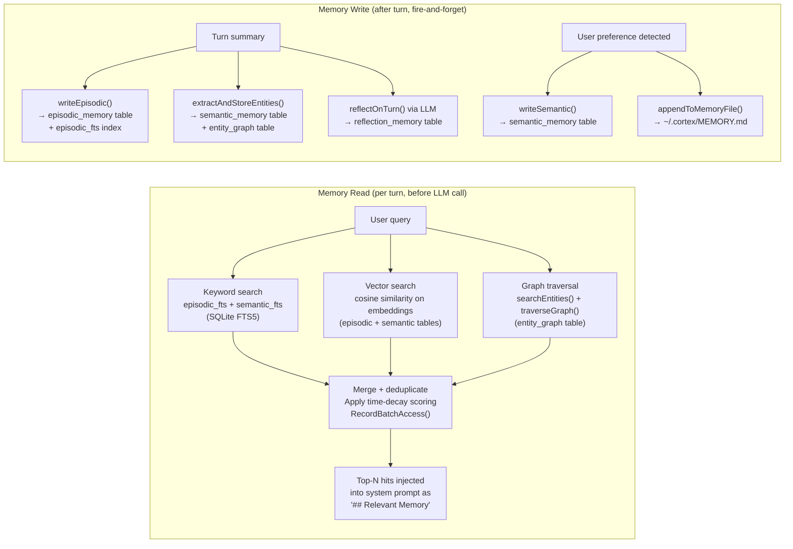
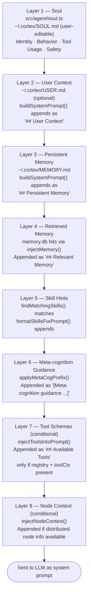

# CortexPrism — Request Flow

Visual maps of the full lifecycle of a user request through the agent system.

---

## Full Request Flow

```mermaid
flowchart TD
    USER([User Message]) --> PREASSESS

    subgraph PIPELINE ["Pipeline Hooks (src/pipeline/)"]
        PREASSESS["pre-assess hook\n— can mutate input or abort"]
        POSTASSESS["post-assess hook\n— can abort after metacog"]
        PREREASON["pre-reason hook\n— runs each LLM round"]
        POSTREASON["post-reason hook\n— can mutate LLM response"]
        PRETOOL["pre-tool hook\n— can block individual tool calls"]
        POSTTOOL["post-tool hook\n— observes tool result"]
        PRELLM["pre-llm hook\n— MQM model selection"]
        POSTLLM["post-llm hook\n— MQM observation recording"]
        PREOUT["pre-output hook\n— can mutate final response"]
        POSTOUT["post-output hook\n— fire-and-forget side effects"]
    end

    PREASSESS -->|aborted| BLOCKED1([Request Blocked])
    PREASSESS -->|passed| PERSIST["Persist user message\n→ session_messages (cortex.db)"]
    PERSIST --> HISTORY["loadHybridHistory()\nRecency window: last 20 msgs (causal anchor)\n+ up to 5 FTS-scored older msgs\n← session_messages"]
    HISTORY --> METACOG

    subgraph METACOG ["MetaCognition (src/agent/metacog.ts)"]
        ASSESS["assessTask()\nAnalyse keywords & patterns"]
        ASSESS --> DECISION{MetaDecision}
        DECISION -->|ask_first| CLARIFY["Return clarification question\n(no LLM call made)"]
        DECISION -->|direct| DIRECT["Proceed directly"]
        DECISION -->|plan_with_rollback| PLAN["Add rollback guidance\nto system prompt"]
        DECISION -->|delegate / parallelize| DELEGATE["Add sub-agent delegation\nguidance to system prompt"]
    end

    POSTASSESS -->|aborted| BLOCKED2([Request Blocked])
    POSTASSESS -->|passed| METACOG

    CLARIFY -->|stream to client| CLARIFY_OUT([Response: Clarification])
    DIRECT --> PROMPTBUILD
    PLAN --> PROMPTBUILD
    DELEGATE --> PROMPTBUILD

    subgraph PROMPTBUILD ["System Prompt Construction (src/agent/loop.ts)"]
        direction TB
        SOUL["1. Base soul\n(soul.ts DEFAULT_SOUL or\nuser's ~/.cortex/SOUL.md)"]
        MEMSEARCH["2. injectMemory()\nRetrieve relevant memories\n→ appended as '## Relevant Memory'"]
        SKILLS["3. findMatchingSkills()\nAppend matching skill definitions"]
        METACOGPFX["4. applyMetaCogPrefix()\nAppend meta-cognition guidance"]
        TOOLINJECT["5. injectToolsIntoPrompt()\n(only if tools registered)\nAppend ## Available Tools block"]
        NODECTX["6. injectNodeContext()\nAppend distributed node info"]

        SOUL --> MEMSEARCH --> SKILLS --> METACOGPFX --> TOOLINJECT --> NODECTX
    end

    PROMPTBUILD --> PRELLM
    PRELLM -->|MQM selects provider+model| LLMLOOP

    subgraph LLMLOOP ["Agent Loop — up to maxToolRounds rounds, default 8 (src/agent/loop.ts)"]
        direction TB
        PREREASON --> LLMCALL["LLM call\n(effectiveProvider.stream())"]
        LLMCALL --> POSTREASON
        POSTREASON --> PARSE{"Parse tool calls\nin response?"}
        PARSE -->|No tool calls| FINALRESP["Final clean response\n→ emit via onChunk"]
        LLMLOOP -->|round ≥ maxToolRounds| CEILING["Ceiling hit:\nSummarise progress + what remains\nhitToolCeiling=true in result"]
        PARSE -->|Tool calls found| EMITPROSE["Emit prose portion\nto client (strip tool XML)"]
        EMITPROSE --> TOOLEXEC
    end

    subgraph TOOLEXEC ["Tool Execution (src/tools/executor.ts)"]
        direction TB
        PRETOOL --> VALIDATE["Policy validation\n(src/security/validator.ts)"]
        VALIDATE -->|denied| TOOLBLOCKED["Tool result: POLICY_DENIED"]
        VALIDATE -->|allowed| EXECUTE["tool.execute(args, context)"]
        EXECUTE --> POSTTOOL
        POSTTOOL --> TOOLLOG["logEvent() → lens.db"]
        TOOLBLOCKED --> TOOLRESULT
        TOOLLOG --> TOOLRESULT["Format <tool_result> XML"]
    end

    TOOLRESULT --> FEEDBACK["Append assistant turn +\ntool results as user message\n→ next round messages"]
    FEEDBACK --> PREREASON

    FINALRESP --> POSTLLM
    POSTLLM --> PREOUT

    PREOUT -->|aborted| BLOCKED3([Request Blocked])
    PREOUT -->|passed| PERSIST_RESP["Persist assistant response\n→ session_messages"]

    subgraph STORAGE ["Post-Turn Storage (fire-and-forget)"]
        direction LR
        EPISODIC["writeEpisodic()\n→ episodic_memory\n(memory.db)"]
        SEMANTIC["extractAndStoreEntities()\n→ semantic_memory\n(memory.db)"]
        PREF["detectAndPersistPreference()\n→ semantic_memory +\n~/.cortex/MEMORY.md"]
        REFLECT["reflectOnTurn() + storeReflection()\n→ reflection_memory\n(memory.db)"]
        LENS["logEvent()\n→ lens.db audit log"]
        SKILL["extractSkillFromSession()\n→ skills table (≥2 tool calls)"]
    end

    PERSIST_RESP --> STORAGE
    STORAGE --> POSTOUT
    POSTOUT --> RESPONSE([Final Response to User])
```

---

## Path A — No Tool Calls

```mermaid
sequenceDiagram
    actor User
    participant Loop as agent/loop.ts
    participant Pipeline as Pipeline Hooks
    participant Prompt as Prompt Builder
    participant LLM as LLM Provider
    participant Memory as memory.db

    User->>Loop: userMessage
    Loop->>Pipeline: pre-assess
    Loop->>Loop: persistMessage(user)
    Loop->>Loop: loadHistory() ← session_messages
    Loop->>Loop: assessTask() [MetaCognition]
    Loop->>Pipeline: post-assess

    Loop->>Memory: retrieve() — keyword + vector + graph search
    Memory-->>Loop: MemoryHit[] (episodic + semantic)
    Loop->>Loop: Build system prompt<br/>[soul → +memory → +skills → +metacog]

    Loop->>Pipeline: pre-llm (MQM model selection)
    Loop->>Pipeline: pre-reason
    Loop->>LLM: provider.stream(messages, systemPrompt)
    LLM-->>Loop: streamed chunks → onChunk()
    Loop->>Pipeline: post-reason

    Note over Loop: No tool calls found in response → exit loop (or maxToolRounds reached)

    Loop->>Pipeline: post-llm
    Loop->>Pipeline: pre-output
    Loop->>Loop: persistMessage(assistant)
    Loop->>Memory: writeEpisodic() [fire & forget]
    Loop->>Memory: extractAndStoreEntities() [fire & forget]
    Loop->>Memory: detectAndPersistPreference() [fire & forget]
    Loop->>Memory: reflectOnTurn() → storeReflection() [fire & forget]
    Loop->>Pipeline: post-output
    Loop-->>User: AgentTurnResult
```

---

## Path B — With Tool Calls

```mermaid
sequenceDiagram
    actor User
    participant Loop as agent/loop.ts
    participant Pipeline as Pipeline Hooks
    participant Exec as tools/executor.ts
    participant Policy as security/validator.ts
    participant Tool as Built-in Tool
    participant LLM as LLM Provider
    participant Memory as memory.db

    User->>Loop: userMessage
    Loop->>Pipeline: pre-assess
    Loop->>Loop: persistMessage(user) + loadHistory()
    Loop->>Loop: assessTask() [MetaCognition]
    Loop->>Pipeline: post-assess
    Loop->>Memory: retrieve() — memory injection
    Loop->>Loop: Build system prompt<br/>[soul → +memory → +skills → +metacog → +tool schemas]
    Loop->>Pipeline: pre-llm (MQM)
    
    loop up to 8 rounds
        Loop->>Pipeline: pre-reason
        Loop->>LLM: provider.stream() — buffered (no direct stream)
        LLM-->>Loop: full response with <tool_call> JSON
        Loop->>Pipeline: post-reason
        Loop->>Loop: parseToolCalls() — extract tool name + args
        Loop->>Loop: emit prose portion via onChunk()

        loop each tool call
            Loop->>Pipeline: pre-tool
            Loop->>Exec: executeTool(tc, registry, toolCtx)
            Exec->>Policy: validateToolCall()
            Policy-->>Exec: allowed / denied
            alt allowed
                Exec->>Tool: tool.execute(args, context)
                Tool-->>Exec: ToolCallResult
            else denied
                Exec-->>Loop: POLICY_DENIED result
            end
            Exec->>Exec: logEvent() → lens.db
            Exec-->>Loop: ToolCallResult
            Loop->>Pipeline: post-tool
        end

        Loop->>Loop: formatToolResults() → <tool_result> XML
        Loop->>Loop: Append assistant + tool results to messages
        Note over Loop: Next round with updated message history
    end

    Note over Loop: No tool calls in final round → exit loop (or maxToolRounds reached → hitToolCeiling=true)
    Loop->>Pipeline: post-llm
    Loop->>Pipeline: pre-output
    Loop->>Loop: persistMessage(assistant)
    Loop->>Memory: writeEpisodic() [fire & forget]
    Loop->>Memory: extractAndStoreEntities() [fire & forget]
    Loop->>Memory: detectAndPersistPreference() [fire & forget]
    Loop->>Memory: reflectOnTurn() → storeReflection() [fire & forget]
    Loop->>Loop: extractSkillFromSession() if ≥2 tool calls
    Loop->>Pipeline: post-output
    Loop-->>User: AgentTurnResult
```

---

## Memory: Read & Write Paths



---

## System Prompt Layers


