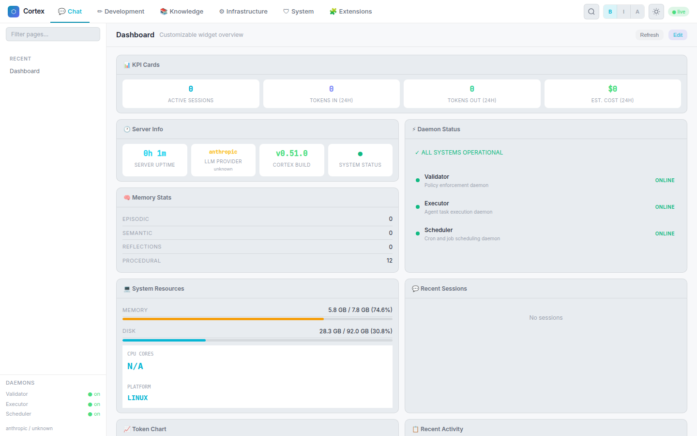
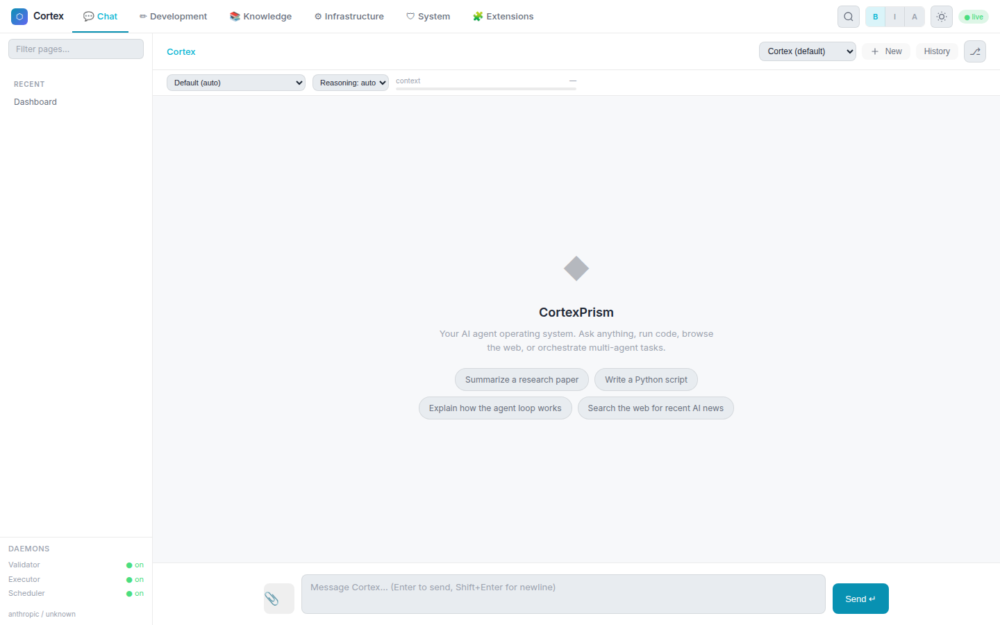
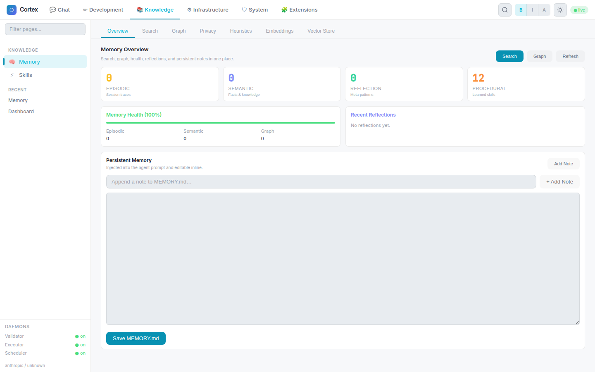
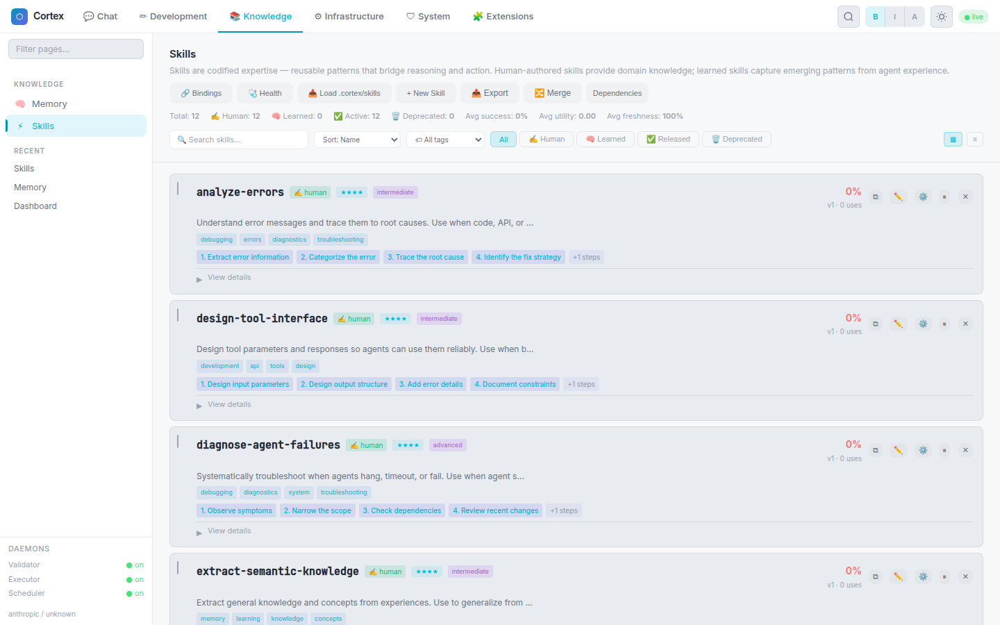
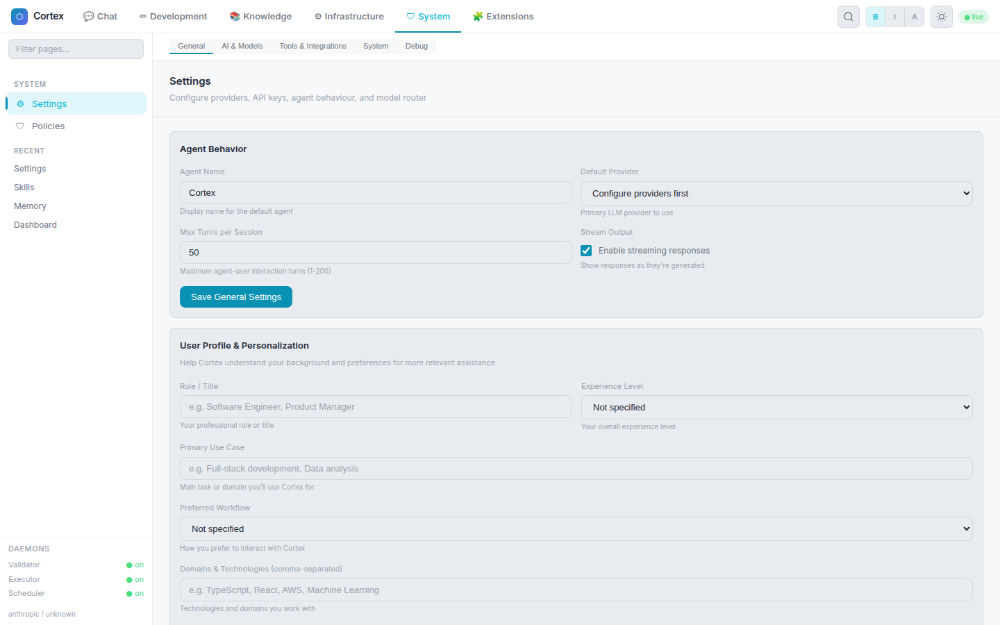
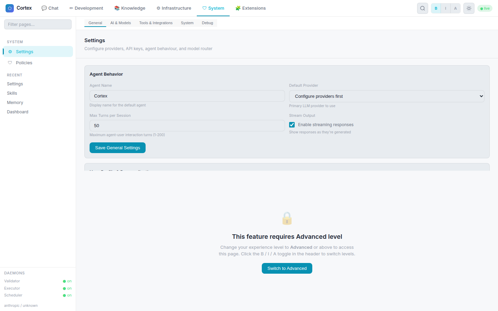
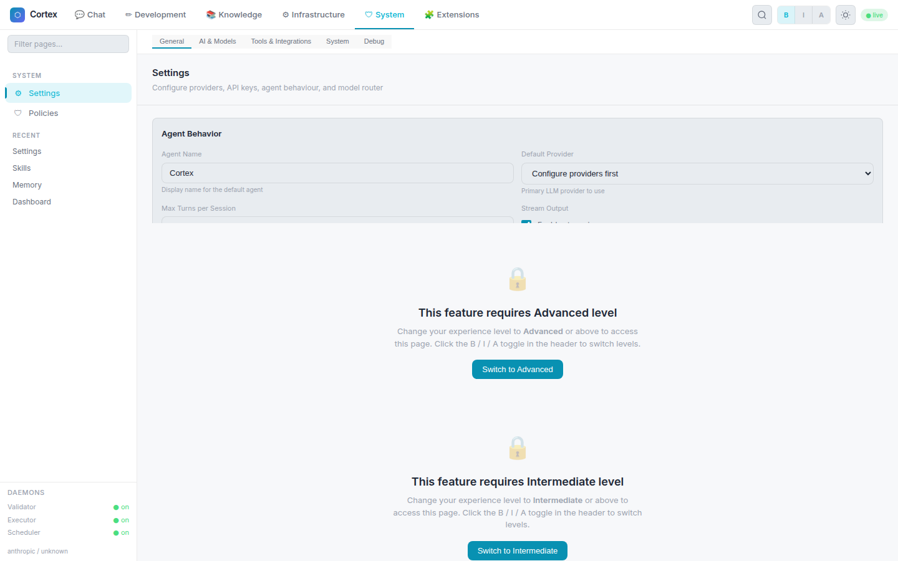

# Cortex UI Gallery

Captured from a local `cortex server start` session. The screenshots below were refreshed from an isolated capture server so they do not depend on the workspace auth state.

## Dashboard

## Chat

## Memory

## Skills

## Settings

## Codegraph

## Tools

